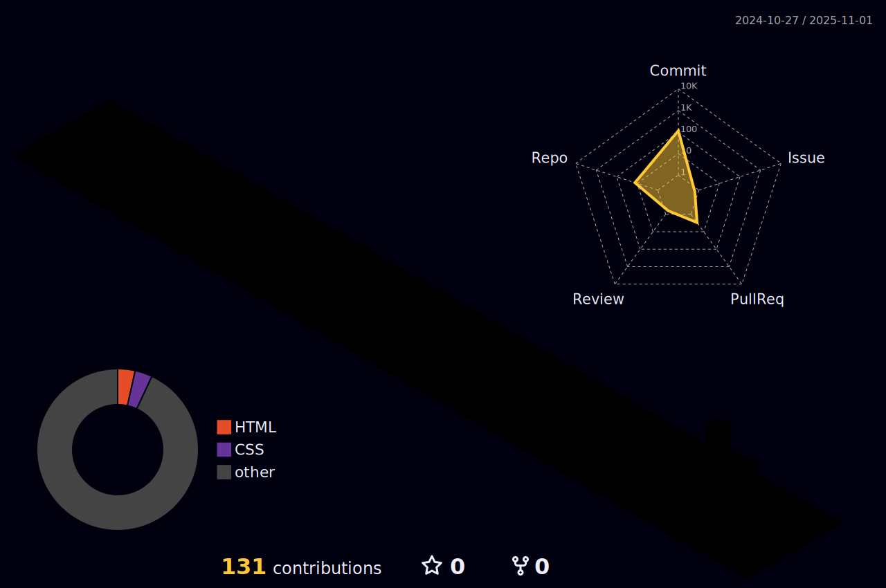

    

    

 

    
<h2>  Sobre mim </h2>

    
 Desenvolvedor Front-End e entusiasta de TI do Brasil, apaixonado por criar experiências digitais únicas. 

    
    <h3>   Um pouco mais de detalhe: </h3>
    <ul>
        <li><a>&nbsp; Tecnologia em Gestão da Informação (TI) — constantemente evoluindo no YouTube e em projetos web. </a></li> 
        <li><a>&nbsp; Atuo com design de interfaces (UI/UX), Figma, desenvolvimento web com HTML, CSS, JavaScript, Vue.js e Tailwind CSS, além de integração com APIs. </a></li> 
        <li><a>&nbsp; Em constante crescimento pessoal, aprimorando habilidades em desenvolvimento web e boas práticas de código limpo. </a></li> 
        <li><a>&nbsp; Transformo ideias em experiências digitais únicas, criando aplicações web funcionais, interativas e visualmente impactantes. </a></li> 
    </ul>
 

 

<h2> Tech Stack </h2>

 

    <h3>🎨 UI/UX Design & Frontend Architecture</h3>
  

    
    
    
    
    
    
    
    
    
  

   

  <h3>🛠️ Backend Frameworks & API Ecosystem</h3>
  

    
    
    
    
    
  

   

  <h3>💻 Core Programming Languages</h3>
  

    
    
    
    
    
    
  

   

  <h3>🧠 Artificial Intelligence & LLM Ops</h3>
  

    
    
    
    
    
    
  

   

  <h3>💾 Databases & Authorization</h3>
  

    
    
    
  

   

  <h3>☁️ DevOps, Cloud & Operating Systems</h3>
  

    
    
    
    
    
    
    
    
    
    
  

   

  <h3>⚙️ Software e Ferramentas</h3>
  

    
    
    
    
    
    
  

 

<h2>  Estatísticas de perfil </h2>

  

      

  

  

  
  

      
  

<picture>
  <source media="(prefers-color-scheme: dark)" srcset="https://raw.githubusercontent.com/davidabx-dev/davidabx-dev/output/pacman-contribution-graph-dark.svg">
  <source media="(prefers-color-scheme: light)" srcset="https://raw.githubusercontent.com/davidabx-dev/davidabx-dev/output/pacman-contribution-graph.svg">
  
</picture>
 

 

<h2>  Calendário de Contribuições 3D </h2>

    

